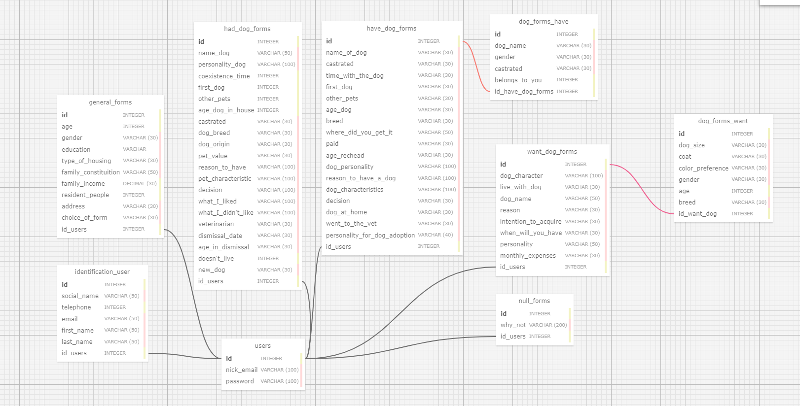

# Ponderada Banco De Dados

## Documentação Simplificada do Modelo Relacional

**Projeto:** Abandono Zero

**Data:** 2024-05-10

**Autor:** Daniel Augusto de Araújo Gonçalves

**Objetivo:** Descrever o modelo relacional do projeto de forma resumida e simplificada.

**Arquivo do modelo relacional do projeto em formato XML**: <a href = "https://github.com/odanielaugusto/PonderadaBancoDeDados/blob/main/ModelagemRelacional.xml" target = "_blank">ModelagemRelacional.xml</a>

**Arquivo do modelo físico do projeto em formato SQL(PostgreSQL)**:<a href = "https://github.com/odanielaugusto/PonderadaBancoDeDados/blob/main/ModelagemFisica.sql" target = "_blank"> ModelagemFísica.sql</a>

## Introdução ao Modelo Relacional

&nbsp;&nbsp;&nbsp;&nbsp;&nbsp;&nbsp;Um modelo relacional é uma forma visual de se organizar os elementos de um banco de dados, sendo desenvolvido por Edgar Frank Codd, entre os anos de 1970 e 1972 <a href = #historia>(A História [...], [20--])</a>. Sendo amplamente utilizado em sistemas de gerenciamento de banco de dados (SGBDs), o modelo relacional é uma abordagem fundamental para armazenar e organizar dados de forma eficiente e consistente.

&nbsp;&nbsp;&nbsp;&nbsp;&nbsp;&nbsp;Seus principais elementos incluem:

1. **Tabelas (ou Relações):** 
Os dados são organizados em tabelas, que consistem em linhas (tuplas) e colunas (atributos). Cada tabela representa uma entidade ou um conjunto de entidades relacionadas. Como uma tabela de "Clientes" que pode ter colunas como "ID do Cliente", "Nome", "Endereço", etc.

2. **Chaves Primárias e Estrangeiras:** Cada tabela geralmente possui uma chave primária única que identifica exclusivamente cada linha na tabela. Chaves estrangeiras são usadas para estabelecer relações entre diferentes tabelas.

3. **Relacionamentos:** Os relacionamentos entre diferentes tabelas são estabelecidos por meio das chaves estrangeiras. Isso permite que os dados sejam normalizados, evitando também redundância, mantendo a integridade referencial.

4. **Integridade Referencial:** Garantia que as relações entre tabelas sejam mantidas corretamente. Por exemplo, não é possível excluir um registro pai se houver registros filhos relacionados a ele por meio de uma chave estrangeira.

## Importância

&nbsp;&nbsp;&nbsp;&nbsp;&nbsp;&nbsp;O modelo relacional é fundamental para qualquer projeto de banco de dados devido à sua capacidade de fornecer uma estrutura organizada e eficiente para representar e manipular dados.

&nbsp;&nbsp;&nbsp;&nbsp;&nbsp;&nbsp;Ao utilizar o modelo relacional, os desenvolvedores podem criar esquemas de banco de dados claros e logicamente estruturados, o que facilita a compreensão e manutenção do sistema ao longo do tempo.

&nbsp;&nbsp;&nbsp;&nbsp;&nbsp;&nbsp;Além disso, o modelo relacional garante a integridade dos dados por meio de restrições como chaves primárias e estrangeiras, garantindo a consistência e a precisão das informações armazenadas. A flexibilidade oferecida pela linguagem SQL (Structured Query Language) permite realizar consultas complexas de forma eficiente, enquanto a normalização dos dados reduz a redundância e otimiza o armazenamento.
 
&nbsp;&nbsp;&nbsp;&nbsp;&nbsp;&nbsp;Em resumo, o modelo relacional é essencial para criar sistemas de banco de dados robustos, seguros e escaláveis, que atendam às necessidades de organizações de todos os tamanhos.

## Diagrama

  Figura 1 - Diagrama do modelo relacional

  

  Fonte: Material produzido pelos autores (2024)

## Entidades

- **Usuários** (`users`): Armazena informações básicas sobre os usuários (nome, email, etc.).
- **Formulários**
  - **Geral** (`general_forms`): Detalhes gerais do usuário (renda, moradia, etc.).
  - **Possuir Cão** (`have_dog_forms`): Informações sobre o cão que o usuário possui (raça, idade, etc.).
  - **Já Teve Cão** (`had_dog_forms`): Informações sobre o cão que o usuário já teve (nome, personalidade, etc.).
  - **Deseja Cão** (`want_dog_forms`): Informações sobre o cão que o usuário deseja ter (tamanho, pelagem, etc.).
  - **Sem Cão** (`null_forms`): Motivo pelo qual o usuário não tem e não deseja ter um cão.
- **Contato** (`user_forms`): Dados para contato futuro com o usuário (nome completo, celular, email).
- **Cão (Possuir)** (`dog_forms_have`): Informações extras sobre o cão que o usuário possui (nome, gênero, castrado, etc.).
- **Cão (Desejar)** (`dog_forms_want`): Informações extras sobre o cão que o usuário deseja ter (tamanho, pelagem, cor, etc.).

## Relacionamentos
1. **users**
    - **general_forms:** Um usuário pode ter um único formulário geral (1:1). A chave estrangeira id_users na tabela general_forms agora é única para refletir essa relação.
    - **have_dog_forms:** Um usuário pode ter um único formulário geral (1:1).
    - **had_dog_forms:** Um usuário pode ter um único formulário geral (1:1).
    - **want_dog_forms:** Um usuário pode ter vários formulários de cães que deseja adotar (1:N).
    - **null_forms:** Um usuário pode ter vários formulários de cães que nunca conviveu ou não tem vontade de ter (1:N).
    - **user_forms:**  Um usuário pode ter apenas um formulário específico de contatos (1:1). A chave estrangeira id_users na tabela user_forms agora é única para refletir essa relação.

2. **general_forms:**
    - Por meio da chave estrangeira id_users, a tabela general_forms se relaciona diretamente com a tabela users.

3. **have_dog_forms:**
    - Por meio da chave estrangeira id_users, a tabela have_dog_forms se relaciona com a tabela users.
    - Por meio da chave estrangeir
6. **null_forms:**
    - id_have_dog_forms, a tabela have_dog_forms se relaciona com a tabela dog_forms_have.

4. **had_dog_forms:**
    - Por meio da chave estrangeira id_users, a tabela had_dog_forms se relaciona com a tabela users.

5. **want_dog_forms:**
    - Por meio da chave estrangeira id_users, a tabela had_dog_forms se relaciona com a tabela users.
    - Por meio da chave estrangeira id_want_dog, a tabela want_dog_forms se relaciona com a tabela dog_forms_want.

6. **null_forms:**
    - Por meio da chave estrangeira id_users, a tabela had_dog_forms se relaciona com a tabela users.

7. **user_forms:**
    - Por meio da chave estrangeira id_users, a tabela had_dog_forms se relaciona com a tabela users.

8. **dog_forms_want:** 
    - Por meio da chave id_want_forms, a tabela dog_form_want se relaciona com a tabela want_dog_form.

9. **dog_forms_have:**
    - Por meio da chave id_have_dog_forms, a tabela dog_forms_have se relaciona com a tabela have_dog_forms.  

<h2>Diagrama de cada tabela:</h2>

  
  1. Tabela users
        - Chave primária para identificação: id.

      - Colunas presentes: id, nick_email, senha.

       - Descrição da tabela: Dados básicos de login do usuário.

       

       Figura 2 - Tabela users 

        

        Fonte: Material produzido pelos autores (2024)

       

  2. Tabela identification_users
      - Chave primária para identificação: id.

      - Chave estrangeira: id_users que referencia users_id.

      - Colunas presentes: id, social_name, telephone, email, firs_name, last_name, id_users.

      - Descrição da tabela: Dados optativos de identificação do usuário.

      

        Figura 3 - Tabela identification_users

        

        Fonte: Material produzido pelos autores (2024)

      
 

  3. Tabela general_forms
      - Chave primária de identificação: id.

      - Chave estrangeira: id_users que referencia users_id.

      -  Colunas presentes: id, age, gender, education, type_of_housing, family_constituition, family_income, resident_people, address, choice_of_form, id_users.

      - Descrição da tabela: Respostas de cada usuário do questionário geral.

      

        Figura 4 - Tabela general_forms

        

        Fonte: Material produzido pelos autores (2024)

      

  4. Tabela had_dog_forms
      - Chave primária para identificação: id.

      - Chave estrangeira: id_users que referencia users_id.

     - Colunas presentes: id, name_dog, personality_dog, coexistence_time, first_dog, other_pets, age_dog_in_house, castrated, dog_breed, dog_origin, pet_value, reason_to_have, pet_characteristic, decision, what_I_liked, what_I_didn't_liked, veterinarian, dismissal_date, age_in_ dismissal, doesn't_live, new_dog, id_users.

      - Descrição da tabela: Respostas de cada usuário do formulário "Já tive um cão".

      

        Figura 5 - Tabela had_dog_forms

        

        Fonte: Material produzido pelos autores (2024)

      

    
  5. Tabela have_dog_forms
      - Chave primária para identificação: id

      - Chave estrangeira: id_users que referencia users_id.

      - Colunas presentes: id, name_of_dog, castrated, time_with_the_dog, first_dog, other_pets, age_dog, breed, where_did_you_get_it, paid, afe_rechead, dog_personality, reason_to_have_a_dog, dog_characteristisc, decision, dog_at_home, went_to_the_ vet, personality_fot_dog_adoption, id_users.
      
      - Descrição da tabela: Respostas de cada usuário do formulário "Eu tenho um cão".

      

        
        Figura 6 - Tabela have_dog_forms

        

        Fonte: Material produzido pelos autores (2024)

      

  6. Tabela dog_forms_have
        - Chave primária para identificação: id.

        - Chave estrangeira: id_have_dog_forms que referencia have_dog_forms_id.

        - Colunas presentes: id, dog_name, gender, castrated, belong_to_you, id_have_dog_forms.

     - Descrição da tabela: Informações mais específicas sobre o cão que o usuário possui.

      

        Figura 7 - dog_forms_have

        

        Fonte: Material produzido pelos autores (2024)

      

7. Tabela want_dog_forms
        
    - Chave primária para identificação: id.

    - Chave estrangeira: id_users que referencia users_id.

    - Colunas presentes: id, dog_character, live_with_dog, dog_name, reason, intention_to_acquire, when_will_you_have, personality, monthly_expenses, id_users

    - Descrição: Respostas do usuário acerca do formulário "Quer ter um cão".

    

     Figura 8 - Tabela want_dog_forms

     

     Fonte: Material produzido pelos autores (2024)

    

8. Tabela dog_forms_want
    - Chave primária para identificação: id.
    
    - Chave estrangeira: id_want_dog que referencia want_dog_forms_id.

    - Colunas presentes: id, dog_size, coat, color_preference, gender, age, breed, id_want_dog.

    - Descrição: Informações mais específicas acerca do tipo de cão que o usuário tem interesse

    

     Figura 9 - Tabela dog_forms_want

     

     Fonte: Material produzido pelos autores (2024)

    

9. Tabela null_forms

    - Chave primária para identificação: id.

    - Chave estrangeira: id_users que referencia users_id.

    - Colunas presentes: id, why_not, id_users.

    - Descrição: Respostas dos usuários acerca do formulário "Porque você não deseja conviver com cães?" 

    

     Figura 10 - Tabela null_forms

     

     Fonte: Material produzido pelos autores (2024)

    

  

## Regras de Negócio <a href = "#regraNegocio">(O que [...], 2023) </a>

1.  **Validação de Dados:**

    - Todos os dados inseridos nos formulários devem ser validados quanto ao formato correto, por exemplo, emails escrito de forma válida e número de telefone no formato apropriado.

    - Os dados inseridos devem estar dentro dos limites aceitáveis.

2. **Salvamento automático**
    
    - Os dados devem ser salvos quando um usuário fechar o formulário sem ter preenchido todos os campos.

3. **Notificação e consentimento**
    - Obter consentimento explícito dos usuários para o processamento de seus dados, especialmente para informações sensíveis.

    - Fornecer a noção clara sobre como os dados serão usados e compartilhados.

4. **Manutenção Preventiva:**

    - Implementar rotinas de manutenção preventiva para garantir a integridade e o desempenho do banco de dados ao longo do tempo.

    - Realizar atualizações regulares de software para corrigir vulnerabilidades conhecidas.

<h1></h1>

## Considerações Finais

Este modelo relacional simplificado fornece uma base para o gerenciamento eficiente das informações dos usuários e suas respostas nos formulários do projeto Abandono Zero. As entidades, seus atributos e relacionamentos garantem a organização e a integridade dos dados. As regras de negócio garantem a consistência e a confiabilidade das informações.

**Observações:**

- Este modelo é uma versão simplificada e pode ser adaptado às necessidades específicas do projeto.
- É importante documentar detalhadamente o modelo relacional para facilitar o entendimento e a manutenção do sistema.
- A implementação do modelo relacional deve seguir boas práticas de desenvolvimento de banco de dados.

## Referências:

A HISTÓRIA dos Banco de Dados. A História dos Banco de Dados, [s. l.], [20--]. Disponível em: <a href = "https://www.devmedia.com.br/a-historia-dos-banco-de-dados/1678">https://www.devmedia.com.br/a-historia-dos-banco-de-dados/1678</a>. Acesso em: 9 maio 2024.

 

O QUE são Regras de Negócio? Qual a importância? Veja exemplos. O que são Regras de Negócio? Qual a importância? Veja exemplos., [s. l.], 1 ago. 2023. Disponível em: <a href = "https://www.sydle.com/br/blog/regras-de-negocio-5f6333be1e43744c69d995e0" >https://www.sydle.com/br/blog/regras-de-negocio-5f6333be1e43744c69d995e0</a>. Acesso em: 11 maio 2024.

